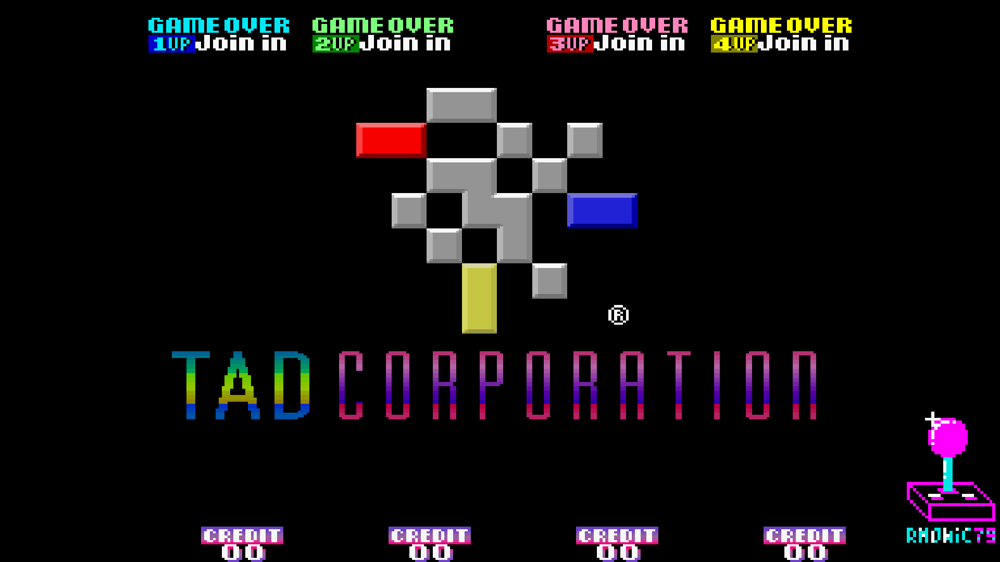
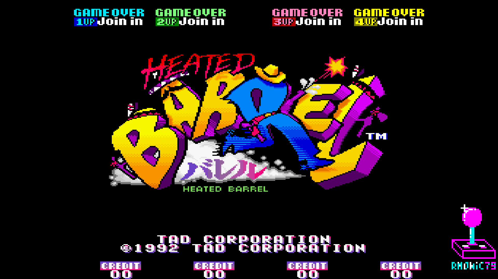
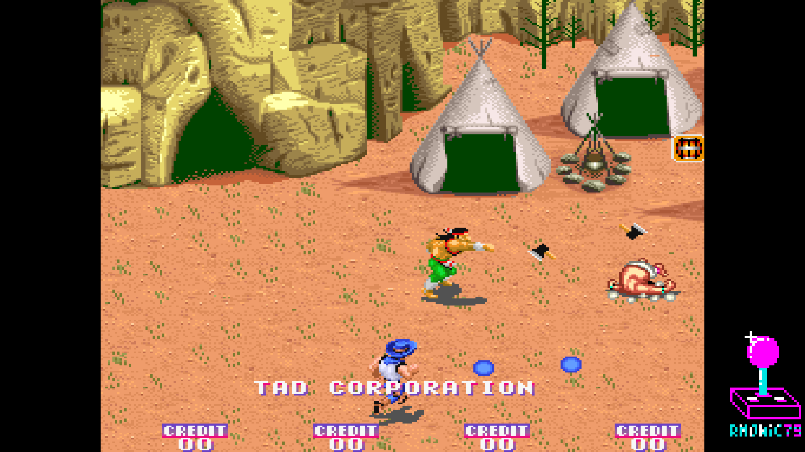
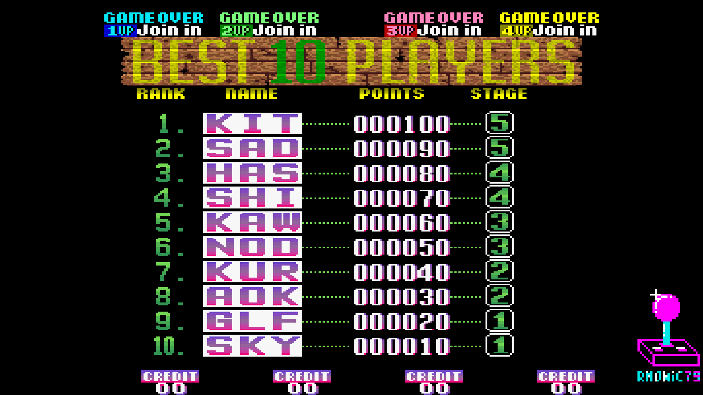
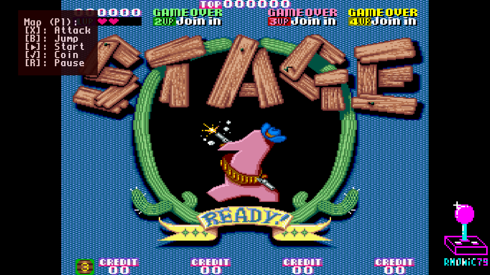
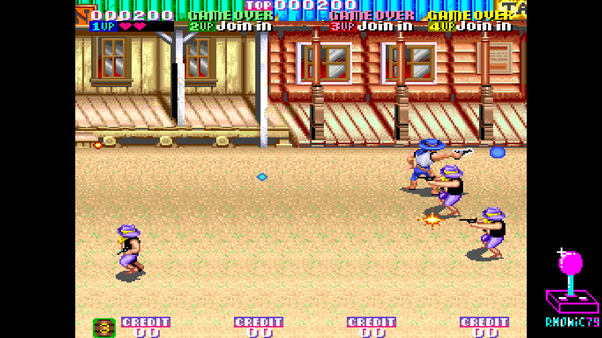

-=(HeatedBarrel_Senhor notes)=-

Tested: Working Video 720p, 1080p & Sound.

___
# Arcade-HeatedBarrel_MiSTer

FPGA core for **Heated Barrel** (TAD Corporation / Seibu, 1992) targeting the
[MiSTer FPGA](https://github.com/MiSTer-devel) platform (Terasic DE10-Nano).

Heated Barrel runs on **Seibu/TAD arcade hardware** — a horizontal board with a
**68000 main CPU**, a Z80 sound CPU, the **Seibu SEI300 / COP coprocessor**
(the `raiden2cop` protection/math unit), Seibu SEI0211 sprite hardware, four
scrolling tilemaps and YM3812 + OKI M6295 audio. It shares the same board
family as *Legionnaire*, with a different memory map and graphics banking.

This core reimplements the hardware in SystemVerilog from MAME references
and hardware observation.

## About the game

**Heated Barrel** is a Western-themed, eight-way run-and-gun shooter for up to
**four players at once** — a rowdy co-op blast that plays like the spiritual
successor to TAD's own **Blood Bros.**, trading the earlier game's two-player
duels for full four-player mayhem across six levels of outlaws, cavalry and
assorted desperados. You pick one of four characters — Howdy Pardner and his
shotgun, boomerang-slinging Chi Chi Gringo, axe-throwing Little Plum, or
six-shooter Billy — and aim freely in eight directions while the screen scrolls
you into the fight.

It runs on the same Seibu/TAD board family as *Legionnaire* and is built on the
Seibu **SEI300 / COP** coprocessor, which drives the aim vectors, collisions and
object DMA. Released in November 1992, Heated Barrel was **TAD Corporation's
final arcade game** before the company closed its doors in early 1993 — which
makes preserving it on FPGA feel a little special.

## Status

**Current version: 1.0** (July 2026).

The core runs the game with video, audio and inputs on real MiSTer hardware.

**Milestones reached**
- Boots and plays with accurate video and controls
- **68000 main CPU** (fx68k) with the Heated Barrel Seibu memory map
- **Seibu SEI300 / COP coprocessor** reproduced from the MAME `raiden2cop`
  reference: sincos / atan (CORDIC) math, distance / divide, object DMA,
  collision detection (2-axis hitboxes), tilemap fill (command 0x118)
- Z80 sound CPU with the Seibu sound latch chain fully working
- MAME-accurate Seibu CRTC tilemaps with per-layer scroll and graphics banking
- Sprite renderer with priority, flip, buffered sprite RAM (SEI0211)
- **Screen-clear (COP fill 0x118)** routed to the render buffers and sprite RAM
  — fixes persisting logos / score overlays
- xBGR-555 palette, MAME-accurate layer priority and sprite/tilemap mixing
- **256×224** display, native **59.4 Hz** refresh (Seibu PCB reference)
- Per-layer calibration offsets hardcoded to match the hardware
- **Sprite line-buffer read fixed**: an analog-only pixel-transient at the
  sprite line boundaries (visible on CRT, normalized away on HDMI) has been
  eliminated by resampling the sprite output on the pixel-clock enable

**Roadmap**
- Improve audio

**Features**
- **68000 main CPU** @ 10 MHz (fx68k)
- Z80 sound CPU @ 3.5795 MHz
- **Seibu SEI300 / COP coprocessor** (raiden2cop): math, object DMA, collisions
- Seibu CRTC: BG / MG / FG / TEXT tilemaps with graphics banking, per-layer scroll
- Sprite renderer with priority, flip, buffered sprite RAM (SEI0211)
- Audio: YM3812 (OPL2, JTOPL2) + OKI M6295 ADPCM (JT6295)
- Tile ROM streaming through SDRAM
- Sprite ROM backed by DDR3
- VBlank-synchronized pause (frame-aligned, no race conditions)
- **Start Stage select** OSD option (start from Stage 1..5)
- Per-chip volume OSD options (FM / OKI ADPCM)
- **Analog VGA CRT Adjust** OSD menu — **H-Size** (horizontal stretch /
  squeeze), **H-Position** and **V-Shift** for CRT alignment — see note below
- MiSTer OSD with video and DIP options
- Pause overlay with logo + supporters scroll

### CRT Adjust — the core-side analog geometry module

**CRT Adjust** is my own module (`rtl/HeatedBarrel/crt_adjust.sv`), the grown-up
successor to the earlier core-side "Analog H-Size" stretch: same content-shift
line-buffer idea, now a full CRT alignment tool. From one always-on line buffer
it gives three live controls in the OSD:

- **H-Size** — horizontal stretch / squeeze, bidirectional and integer, for
  filling or pulling in the picture width on a CRT
- **H-Position** — horizontal image shift
- **V-Shift** — vertical line shift

On a narrow, side-anchored game like Heated Barrel the module runs in its
sync-shift mode: H-Position slides the **HSync** while the content stays anchored
natively, so the picture moves on the CRT with no black block appearing at the
screen edges, and the CRT keeps its lock the whole time — no rolling, tearing or
loss of hold. The stretch is integer and line-buffered, so it is **free of
shimmering, blending or scaling artifacts** on the analog output.

> **Note — this is a newer CRT Adjust than the GundamSD release.** The module
> here carries fixes made specifically for **narrow, side-anchored games**
> (256-px active anchored high in the line, as on Legionnaire and Heated
> Barrel). The GundamSD build ships the earlier content-shift-only version,
> which is correct for a wide/centered 320-px game but, on a narrow anchored
> game, would push the image into a black block at the edge and mis-align the
> right edge while enlarging. This version adds the selectable **sync-shift**
> H-Position mode (`HPOS_MODE`) that keeps H-Position and H-Size clean on such
> games. It will be back-ported to GundamSD later.

Why core-side? A cleaner approach exists as a module inside `sys_top`, where only
the analog DAC is touched and HDMI stays untouched — but the MiSTer-devel
guidelines say the framework (`sys/`) must not be modified. CRT Adjust lives
entirely **core-side** with zero `sys_top` changes, so the core stays fully
compliant. The trade-off: the adjust reaches the analog DAC **and** HDMI follows
it too — so **while CRT Adjust is On you cannot have a clean HDMI image at the
same time as the resize**. Leave CRT Adjust **Off** (default) for an untouched
HDMI output.

## Screenshots

| | |
|---|---|
|  |  |
| TAD Corporation | Title |
|  |  |
| Attract | Score |
|  |  |
| Gameplay | Gameplay |

## Hardware emulated

| Component        | Spec                                                     |
|------------------|----------------------------------------------------------|
| Main CPU         | Motorola 68000 @ 10 MHz (fx68k)                          |
| Sound CPU        | Zilog Z80 @ 3.5795 MHz                                   |
| Coprocessor      | Seibu SEI300 / COP (raiden2cop): math, DMA, collisions  |
| Sound chip 1     | Yamaha YM3812 OPL2 (jtopl2)                              |
| Sound chip 2     | OKI M6295 ADPCM (jt6295)                                 |
| Tilemaps         | Seibu CRTC: BG / MG / FG / TEXT (16×16 / 8×8, banked)    |
| Sprites          | Seibu SEI0211 sprite generator                          |
| Palette          | xBGR-555, 2048 entries                                   |
| Resolution       | 256×224 @ 59.4 Hz                                        |

## Hardware requirements

- Terasic DE10-Nano
- MiSTer I/O board (recommended)
- SDRAM module (32 MB or 64 MB)
- DDR3 memory (built into DE10-Nano, used for sprite ROM)
- Works on HDMI displays and on CRTs via the analog video output

## Building from source

Requires Quartus Prime 17.0 (free Lite Edition).

```
Open HeatedBarrel.qpf in Quartus → Processing → Start Compilation
```

Output bitstream is generated in `output_files/HeatedBarrel.rbf`.

## Running on MiSTer

The [releases/](releases/) folder contains the MRA and a prebuilt RBF:

- `HeatedBarrel.mra` — parent MRA (MAME `heatbrl`)
- `HeatedBarrel_YYYYMMDD.rbf` — prebuilt bitstream

Steps:

1. Copy the `.rbf` to `_Arcade/cores/` on the MiSTer SD card (rename to
   `HeatedBarrel.rbf` or keep the dated name and update the MRA accordingly).
2. Copy the `.mra` file to `_Arcade/` on the MiSTer SD card.
3. Provide your legally-owned `heatbrl.zip` where the MRA expects it
   (usually in `games/mame/`).

**ROMs are NOT included in this repository.** You must provide them yourself.

## Repository layout

```
Arcade-HeatedBarrel_MiSTer/
├── rtl/
│   ├── HeatedBarrel/      Heated Barrel-specific core RTL (COP3, CRTC, renderers)
│   ├── fx68k/             68000 main CPU
│   ├── t80/               Z80 sound CPU
│   ├── jtopl2/            YM3812 FM synth
│   ├── jt6295/            OKI M6295 ADPCM
│   ├── jtframe/           JTFRAME framework modules
│   ├── pll/               Clock PLL
│   └── sdram.sv           SDRAM controller (Sorgelig)
├── sys/                   MiSTer framework (Sorgelig / MiSTer-devel)
├── logo/                  Pause overlay assets (font, logo, supporter list)
├── docs/                  In-game screenshots
├── releases/             MRA + prebuilt RBF
├── HeatedBarrel.qpf       Quartus project
├── HeatedBarrel.qsf       Quartus assignments
├── Template.sv            Top-level wrapper
├── Template.sdc           Timing constraints
├── files.qip              HDL file list
├── build_id.v             Build version stamp
└── README.md              This file
```

## Acknowledgements

- **Jose Tejada** ([@jotego](https://github.com/jotego)) for JTOPL2 (YM3812),
  JT6295 (OKI M6295) and the JTFRAME framework.
- **Jorge Cwik** for the **fx68k** cycle-accurate 68000 core.
- The **MAMEDev team** for the invaluable reference on the Seibu SEI300 / COP
  coprocessor (`raiden2cop`), the Seibu CRTC and sprite hardware, memory maps
  and timing.
- **Sorgelig** and the **MiSTer-devel team** for the framework, SDRAM
  controller and Template.
- **Andrea Bogazzi** ([@asturur](https://github.com/asturur)) for help with the
  core-side CRT Adjust implementation.

## Support this project

If you enjoy this core and want to support its development:

- [Ko-fi](https://ko-fi.com/ibecerivideoludici) — one-time support
- [Patreon](https://www.patreon.com/IBeceriVideoludici) — monthly support
- [PayPal](https://www.paypal.me/IBeceriVideoludici) — one-time donation

## Follow

- [GitHub](https://github.com/rmonic79)
- [Twitch](https://twitch.tv/ibecerivideoludici) — live streams
- [YouTube](https://www.youtube.com/c/IBeceriVideoludici) — playlists and videos
- [X / Twitter](https://x.com/rmonic79)

## License

The RTL source code in this repository is provided as-is for educational
and preservation purposes under **GNU GPL v3 or later**. Original ROM data
is not included; users must provide their own legally obtained copies.

Original *Heated Barrel* arcade hardware © TAD Corporation / Seibu, 1992.
